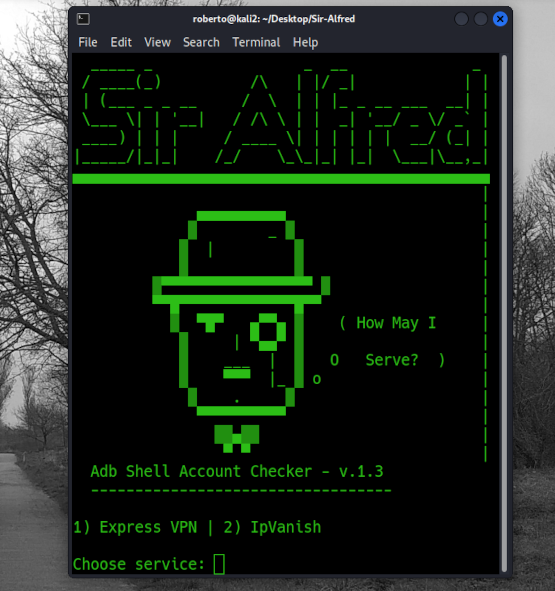

# Sir-Alfred
--------------------------------------------------------------------------------------


### Current version: 5.5 Inch Android Device (due to 'keyevents.tap') ###
--------------------------------------------------------------------------------------

Automated Account checker for Android apps, using Python and ADB shell. 

This software is not intended for illegal purposes.

Reads from file and uses shell sendevents to access device, including ``` dumpsys ``` to obtain changes in activity.

Your Phone needs ``` Developer Options > Android Debugging ``` enabled in order to be connected. Some future functions may need root.

--------------------------------------------------

#### Requires Android Debug Bridge running, i.e. :

``` sudo apt-get install android-tools-adb ```

#### Requires pure-python-adb, i.e.:

``` pip3 install -U pure-python-adb ```

#### Run ADB server before starting, i.e.:

``` adb devices ```

--------------------------------------------------

#### To do:

- *Fix 429 response on some apps with tricks*
- *Fix similar 'Too many requests' responses on some apps with proxies/tricks*
- *Add more clients*
- *Add option to restart/quit after list exhaustion*
- *Add option to select user directories for read/write*
- *Add relative paths (i.e. ``` from pathlib import Path ``` )*
- *Add option to select type of combo file so that correct ``` .split() ``` method can be used (i.e. *user:pass* or *user:pass | TEST ACCOUNT BY* etc..)*
